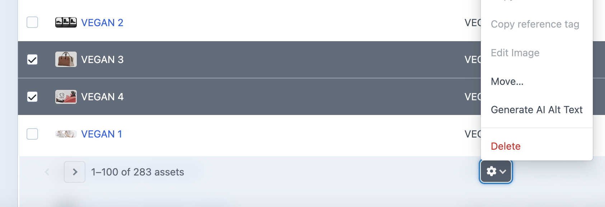

# 🤖 💬 AI Alt Text
  
Generate suitable alt text for CraftCMS Asset Images using OpenAI's API.

[Plugin Store](https://plugins.craftcms.com/ai-alt-text?craft5) | [GitHub Repository](https://github.com/heavymetalavo/craft-aialttext)

## Video demo

https://github.com/user-attachments/assets/0f7eb3e5-bf33-4f49-a8b8-6579a4c05f8b

## 📋 Requirements

This plugin requires: 
- Craft CMS 5.0.0 or later
- PHP 8.2 or later
- An OpenAI API key

## 📥 Installation

You can install this plugin from [the Plugin Store](https://plugins.craftcms.com/ai-alt-text?craft5) or with Composer.

### 📦 With Composer

Open your terminal and run the following commands:

```sh
# tell Composer to load the plugin
composer require heavymetalavo/craft-aialttext
# or
ddev composer require heavymetalavo/craft-aialttext
```

Then:

```sh
# tell Craft to install the plugin
./craft plugin/install ai-alt-text
# or
ddev craft plugin/install ai-alt-text
```

## 🤖 Setup OpenAI API Key

1. Visit [https://platform.openai.com/](https://platform.openai.com/) and [sign up](https://platform.openai.com/signup) in the top-right.
2. Revisit [the API platform home page](https://platform.openai.com/) again
3. Click the ⚙️ icon in the top-right
4. Left menu > Organization > API keys > + Create new secret key (top-right)
5. Create a name and assign to a suitable project
6. Permissions > Restricted > set "Model capabilities" to "Write" and "Responses API" to "Write"
7. Save API key to an env var, you wont get to see it again!
8. Make sure you have a credit balance! Left menu > Organization > Billing, loading $5 is probably going to get you quite far, disabling auto recharge might be safer though that's up to you!

## 🚀 How to use

1. Check the plugin settings are suitable for your project (and your API key is added)
2. Ensure your volumes have the native `alt` field assigned to the field layout
3. Ensure your templates are updated to use the `alt` field, you could consider a fallback `asset.alt ?: asset.title` if that what was used before
4. Then generate some AI Alt text by performing one of the following actions:
    1. Triggering a bulk action in the bulk actions table
    2. For individual or a group of specific assets find them in the <strong>Assets</strong> manager section</a> clicking the checkbox on a row, clicking the cog icon to reveal the Element actions menu and select <strong>Generate AI Alt Text</strong>
    3. When viewing a single asset's page, open the action menu and select <strong>Generate AI Alt Text</strong>
    4. Upload a new asset (if the upload setting is enabled)
5. The plugin will queue jobs to generate alt text for each selected asset

Alternatively, you can enable the "Generate for new assets" option in the plugin settings to automatically generate alt text for newly uploaded assets.



Example twig:

```twig


```

## ⚙️ Plugin settings

After installation, configure the plugin at **Settings → AI Alt Text**:

### 📊 Settings overview

| Setting | Description | Default |
|---------|-------------|---------|
| **API Key** | Your OpenAI API key. You can get one from [OpenAI's API Platform](https://platform.openai.com/api-keys). | None (required) |
| **Model** | The OpenAI model to use for generating alt text. | `gpt-4.1-nano` |
| **Prompt** | The text prompt sent to the AI to generate alt text. Supports `{asset.property}` and `{site.property}` | See below |
| **Image Detail Level** | How detailed the image analysis should be. | `low` |
| **Pre-save Asset** | Whether to pre-save the asset if alt field is empty before saving a value to it. This prevents the same initial value being saved to each Site. | `true` |
| **Generate for new assets** | Whether to automatically generate alt text when new assets are created. | `false` |
| **Save Translated Results to Each Site** | Whether to save translated results to an Asset's translatable alt text field for each Site. | `false` |

#### 🧠 Model Options
Models that support vision capabilities:
- `gpt-4.1-nano` - Fast, affordable small model for focused tasks (default)
- `gpt-4o` - Fast, intelligent, flexible GPT model
- `o1` - High-intelligence reasoning model

To find out which models are capable of vision, check [the models page](https://platform.openai.com/docs/models), click into a model's detail page (e.g., [GPT-4.1-nano](https://platform.openai.com/docs/models/gpt-4.1-nano)) and look for "**Input**: Text, image" in the features columns at the top.

#### 💬 Default prompt

> Generate a brief (roughly 150 characters maximum) alt text description focusing on the main subject and overall composition. Do not add a prefix of any kind (e.g. alt text: AI content) so the value is suitable for the alt text attribute value of the image. Output in {site.language}

#### 🔍 Image detail options
- `low` - Less detailed, faster and cheaper (default to protect against unexpected costs)
- `high` - More detailed, slower and more expensive (higher resolution analysis)
- `auto` - Let OpenAI decide

For more information about these settings, refer to the [OpenAI API documentation](https://platform.openai.com/docs/guides/images).

## 🏷️ Field requirements

This plugin requires a native CraftCMS field for alt text with the handle `alt` to be added to all asset volumes where you want to generate alt text. The plugin will use this field to store the generated alt text.

To add this field:
1. Go to **Settings → Assets → Volume name → + Add → search for the `alt` field and click → save**
2. Scroll to Field Layout section
3. Click the `+ Add` button
4. Search for the `alt` field and click 
5. Save changes to the volume
6. Update your templates to use the new `alt` field

## 🛠️ Troubleshooting

- If the plugin returns errors about API authentication, verify your API key.
- For "bad request" errors, ensure your selected model supports vision capabilities.
- Alt text generation is processed through Craft's queue system for bulk operations, so check the queue if generation seems to be taking a long time.
- Any errors _should_ be logged, check your queue.log files!

## ⚠️ Disclaimer

We've taken some steps to try prevent unexpected costs with default plugin settings (e.g. detail: `low` and model: `gpt-4.1-nano`) though we take no responsibility for excessive API token usage that may result from mistakes, bugs, or security vulnerabilities within this plugin so use at your own risk.

If you are concerned about unexpected charges we recommend:
- Set up rate limits and spending caps at the API account level in your [OpenAI account settings](https://platform.openai.com/account/billing/limits)
- Start with smaller batches when using bulk generation until you're comfortable with the costs
- Consider using the default `low` setting, which significantly reduces token usage
- Monitor your OpenAI API usage regularly

### 📈 Example usage statistics

When testing using the default settings (`gpt-4o-mini` model, `low` detail level):

| Metric | Value |
|--------|-------|
| March budget | $0.03 / $120 |
| Total tokens used | 163,713 |
| Total requests | 29 |

## 🙋 Support

If you encounter any issues or have questions, please submit them on [GitHub](https://github.com/heavymetalavo/craft-aialttext/issues).

## Credits

The eye icon used in this project is from [SVG Repo](https://www.svgrepo.com/svg/193488/eye) and is available under the CC0 1.0 Universal (Public Domain) license.
