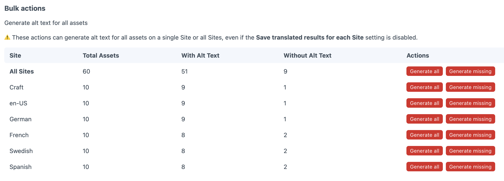
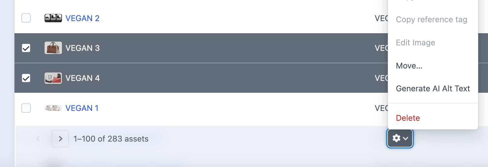
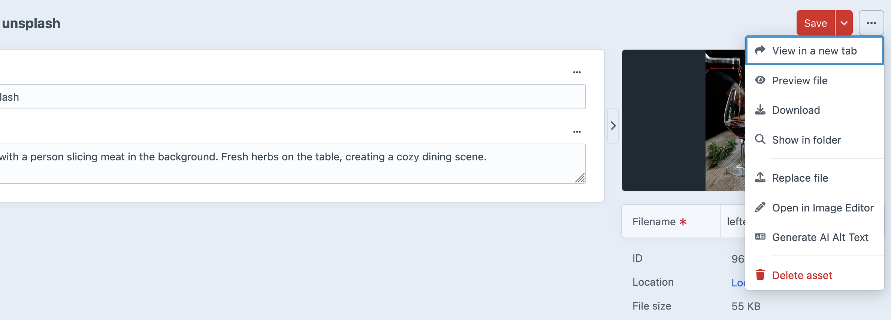

# 🤖 💬 AI Alt Text
  
Generate alt text for CraftCMS Asset Images using the Anthropic or OpenAI API.

[Plugin Store](https://plugins.craftcms.com/ai-alt-text?craft5) | [GitHub Repository](https://github.com/heavymetalavo/craft-aialttext)

## Video demo

https://github.com/user-attachments/assets/0f7eb3e5-bf33-4f49-a8b8-6579a4c05f8b

## 📋 Requirements

This plugin requires: 
- Craft CMS 5.0.0 or later
- PHP 8.2 or later
- An Anthropic API key or an OpenAI API key

## 📥 Installation

You can install this plugin from [the Plugin Store](https://plugins.craftcms.com/ai-alt-text?craft5) or with Composer.

### 📦 With Composer

Open your terminal and run the following commands:

```sh
# tell Composer to load the plugin
composer require heavymetalavo/craft-aialttext
# or
ddev composer require heavymetalavo/craft-aialttext
```

Then:

```sh
# tell Craft to install the plugin
./craft plugin/install ai-alt-text
# or
ddev craft plugin/install ai-alt-text
```

## 🤖 Setup API Keys

### Anthropic

1. Visit [https://console.anthropic.com/](https://console.anthropic.com/) and [sign up](https://console.anthropic.com/).
2. Navigate to **Settings → API Keys**.
3. Create a new API key and save it to an environment variable (`.env`).
4. Ensure you have credits in your account under **Billing**.

### OpenAI

1. Visit [https://platform.openai.com/](https://platform.openai.com/) and [sign up](https://platform.openai.com/signup) in the top-right.
2. Revisit [the API platform home page](https://platform.openai.com/) again
3. Click the ⚙️ icon in the top-right
4. Left menu > Organization > API keys > + Create new secret key (top-right)
5. Create a name and assign to a suitable project
6. Permissions > Restricted > set "Model capabilities" to "Write" and "Responses API" to "Write"
7. Save API key to an env var, you wont get to see it again!
8. Make sure you have a credit balance! Left menu > Organization > Billing, loading $5 is probably going to get you quite far, disabling auto recharge might be safer though that's up to you!

## 🚀 How to use

1. Check the plugin settings are suitable for your project (and your API key is added)
2. Ensure your volumes have the native `alt` field assigned to the field layout
3. Ensure your templates are updated to use the `alt` field, you could consider a fallback `asset.alt ?: asset.title` if that what was used before
4. Then generate some AI Alt text by performing one of the following actions:
    1. Triggering a bulk action in the bulk actions table
    2. For individual or a group of specific assets find them in the <strong>Assets</strong> manager section</a> clicking the checkbox on a row, clicking the cog icon to reveal the Element actions menu and select <strong>Generate AI Alt Text</strong>
    3. When viewing a single asset's page, open the action menu and select <strong>Generate AI Alt Text</strong>
    4. Upload a new asset (if the upload setting is enabled)
5. The plugin will queue jobs to generate alt text for each selected asset







Example twig:

```twig


```

## 🖥️ Console Commands

**Important**: These commands will create **queue** jobs which when run will generate the alt text. By default, all commands process **all sites** unless `--site-id` is specified.

### Available Commands

| Command | Description |
|---------|-------------|
| `ai-alt-text/generate/stats` | Show alt text coverage statistics |
| `ai-alt-text/generate/missing` | Queue jobs for assets without alt text (recommended) |
| `ai-alt-text/generate/all` | Queue jobs for ALL assets (⚠️ overwrites existing alt text) |
| `ai-alt-text/generate/single <id>` | Queue job for a specific asset ID |

### Options

| Option | Alias | Description | Default |
|--------|-------|-------------|---------|
| `--site-id=<id>` | `-s` | Process only specific site (if not set, processes all sites) | * |
| `--batch-size=<n>` | `-b` | Assets per batch (memory efficiency) | `500` |
| `--verbose` | `-v` | Show detailed progress | `false` |
| `--force` | `-f` | Skip confirmations | `false` |

### Examples

```sh
# Check coverage across all sites
./craft ai-alt-text/generate/stats

# Queue missing alt text for all sites
./craft ai-alt-text/generate/missing

# Queue for specific site with verbose output
./craft ai-alt-text/generate/missing --site-id=2 --verbose

# Queue for single asset
./craft ai-alt-text/generate/single 123
```

## ⚙️ Plugin settings

After installation, configure the plugin at **Settings → AI Alt Text**:

### 📊 Settings overview

| Setting | Description |
|---------|-------------|
| **AI Provider** | Choose between OpenAI or Anthropic. |
| **OpenAI/Anthropic API Key** | Your provider's API key. |
| **Model** | The AI model to use (e.g., `gpt-5-nano` or `claude-haiku-4-5`). |
| **Detail Level**| How detailed the image analysis should be (controls resolution/scaling). |
| **Prompt** | The text prompt sent to the AI providers (example [below](#default-prompt)). Supports `{asset.property}` and `{site.property}` |
| **Propagate** | Whether the asset should be saved across all of its supported sites, if enabled it could save the same initial alt text value across all sites. |
| **Generate for new image assets (on upload)** | Automatically generate alt text when new assets are created. |
| **Save translated results for each site** | Save translated results to translatable fields for each site. |

#### 🧠 Model Options

All vision models should work, these small models seem to hit the sweetspot between quality & cost:
- `claude-haiku-4-5` - For Anthropic: "The fastest model with near-frontier intelligence"
- `gpt-5-nano` - For OpenAI: "Fastest, most cost-efficient version of GPT-5"

To find out which models are capable of vision, check [the models page](https://platform.openai.com/docs/models), click into a model's detail page (e.g., [gpt-5-nano](https://platform.openai.com/docs/models/gpt-5-nano)) and look for "**Input**: Text, image" in the features columns at the top.

#### 💬 Default prompt

> Describe the image provided (roughly 150 characters). The output MUST be suitable for use directly as an HTML alt attribute value. Consider transparency within the image if supported by the file type, e.g. don't suggest it has a dark background if it is transparent. When describing a person do not assume their gender. Do not add a prefix of any kind (e.g. "#", "alt text:", "An image of", "A photo of"). Do not wrap the output in quotes. Output in the language: {site.language}

#### 🔍 Image detail options

**OpenAI:**
- `low` - Fast, low-cost (512px x 512px) (default)
- `high` - Standard high-fidelity understanding
- `original` - Large, dense, spatially sensitive images (gpt-5.4+)
- `auto` - Let the model choose

**Anthropic:**
- `low` - 500px x 500px (recommended default)
- `medium` - 1000px x 1000px
- `high` - 1568px x 1568px

For more information, refer to the [OpenAI](https://platform.openai.com/docs/guides/images) and [Anthropic](https://docs.anthropic.com/en/docs/build-with-claude/vision) documentation.

## 🏷️ Field requirements

This plugin requires a native CraftCMS field for alt text with the handle `alt` to be added to all asset volumes where you want to generate alt text. The plugin will use this field to store the generated alt text.

To add this field:
1. Go to **Settings → Assets → Volume name → + Add → search for the `alt` field and click → save**
2. Scroll to Field Layout section
3. Click the `+ Add` button
4. Search for the `alt` field and click 
5. Save changes to the volume
6. Update your templates to use the new `alt` field

### Provider-Specific Limits

- **Automatic Scaling**: The plugin automatically detects when an image exceeds provider limits and applies transforms (resizing or quality reduction) before sending the payload.
- **Supported file types**: Both AI providers support: `png`, `jpeg`, `jpg`, `webp`, `gif` (non-animated)
- **SVG Support**: SVGs are rasterized to PNG (preserving transparency) before being sent to the AI (where transformSvgs is enabled).
- **Animated GIFs**: Only the first frame is processed.
- **Private Assets**: Assets on private volumes without public URLs will be sent as base64 encoded strings. Assets which require transform before being base64 encoded are not currently supported by CraftCMS.
- **Servd/Cloud**: Support for specialized asset bundles (like Servd) depends on the environment's ability to handle raster transforms.
- **Consider AI Provider level boundaries**: e.g. OpenAI: "No watermarks or logos - No NSFW content - Clear enough for a human to understand"

## Oddities, Logic & Limitations

- The OpenAI API has [image input requirements](https://platform.openai.com/docs/guides/images-vision?api-mode=responses#image-input-requirements) which over the lifespan of this plugin have changed without notice, the requirements are not always enforced, e.g. base64 encoded images above the required image dimensions have been accepted by the API.
- Craft CMS uses the [Imagine library](https://github.com/php-imagine/Imagine) for image processing, which can only transform [select image formats](https://github.com/php-imagine/Imagine/blob/develop/src/Image/Format.php#L14-L32). Support for these formats may vary depending on what ImageMagick drivers are available in your environment. If a source image is in a supported format, the plugin will generate a transform in one of the supported file types to send to the OpenAI API.
- Where an unsupported file type is requested the plugin will attempt an image transform to a jpg to be sent instead
- The plugin checks a file's mimetype to see if it's valid, or if it needs a format conversion before sending to the API
- If an asset's dimensions are larger than the dimensions required by the API an image transform is sent instead
- If an asset has no URL (private) and requires a transform (e.g. if the original asset is an unsupported mime type, or, the dimensions are too large) the plugin [cannot retrieve the transform's file contents](https://github.com/craftcms/cms/issues/17238#issuecomment-2873206148) to send a base64 encoded version of the image to the OpenAI API.
- Where an alternative image transformer is used, e.g. when an application is hosted on [Servd](https://servd.host) and assets are processed through their asset platform this may not support svg -> raster transforms

## 🛠️ Troubleshooting

- If the plugin returns errors about API authentication, verify your API key.
- For "bad request" errors, ensure your selected model supports vision capabilities.
- Alt text generation is processed through Craft's queue system for bulk operations, so check the queue if generation seems to be taking a long time.
- Any errors _should_ be logged, check your queue.log files!
- Check the asset has a title! If somehow an asset exists without one craft will not be able to resave it.

## ⚠️ Disclaimer

We've taken some steps to try prevent unexpected costs with default plugin settings (e.g. detail: `low` and model: `gpt-5-nano`) though we take no responsibility for excessive API token usage that may result from mistakes, bugs, or security vulnerabilities within this plugin so use at your own risk.

If you are concerned about unexpected charges we recommend:
- Set up rate limits and spending caps at the API account level in your [OpenAI account settings](https://platform.openai.com/account/billing/limits)
- Start with smaller batches when using bulk generation until you're comfortable with the costs
- Consider using the default `low` setting, which significantly reduces token usage
- Monitor your OpenAI API usage regularly

### 📈 Example usage statistics

When testing with OpenAI using the default settings (`gpt-4o-mini` model, `low` detail level):

| Metric | Value |
|--------|-------|
| March budget | $0.03 / $120 |
| Total tokens used | 163,713 |
| Total requests | 29 |

## 🙋 Support

If you encounter any issues or have questions, please submit them on [GitHub](https://github.com/heavymetalavo/craft-aialttext/issues).

## Credits

The eye icon used in this project is from [SVG Repo](https://www.svgrepo.com/svg/193488/eye) and is available under the CC0 1.0 Universal (Public Domain) license.
